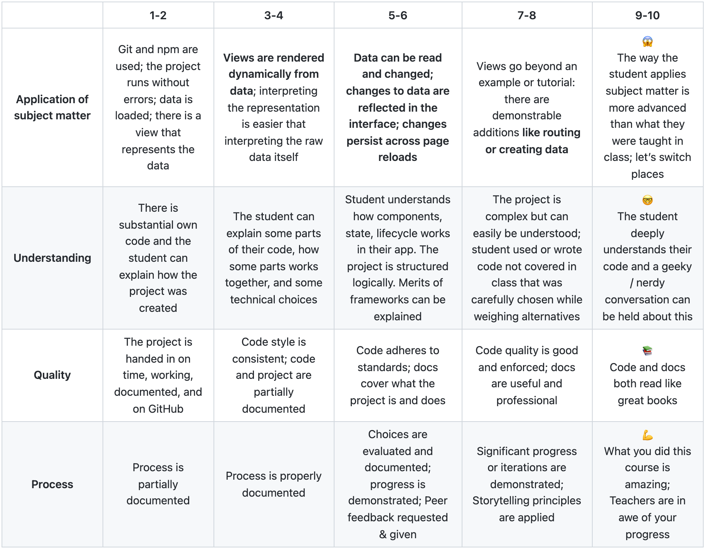

# :desktop_computer: Frontend Applications

## :bookmark_tabs:	 Table of Contents

* [Concept](https://github.com/lottekoblens/frontend-applications#bulb-concept)
* [Proces](https://github.com/lottekoblens/frontend-applications#chart_with_upwards_trend-proces)
* [Installation](https://github.com/lottekoblens/frontend-applications#wrench-installation)
* [Data](https://github.com/lottekoblens/frontend-applications/#file_folder-data)
* [Wishlist](https://github.com/lottekoblens/frontend-applications#pencil-wishlist)
* [Assignment](https://github.com/lottekoblens/frontend-applications#clipboard-assignment)
  * [Rubric](https://github.com/lottekoblens/frontend-applications#page_facing_up-rubric)
* [Resources](https://github.com/lottekoblens/frontend-applications#mag_right-resources)
* [License](https://github.com/lottekoblens/frontend-applications#page_with_curl-license)

## :bulb: Concept


I've been working on this project for two weeks. In those two weeks I had to make a visualization with D3 and React. I displayed the data of the most popular songs of The Netherlands in a bar chart. The bar chart has a filter with two options:

* Show the duration of the song
* Show the amount of listeners of the song.

On the y scale the name of the song will be displayed as you can see above. 

I also added an hover. With this hover the data about the bar on which you hover will be displayed. This can also be seen above in the gif.

## :chart_with_upwards_trend: Proces

If you want to know more about my proces. You can read my [Wiki](https://github.com/lottekoblens/frontend-applications/wiki)!

## :wrench: Installation

If you want to use this code you have to clone the repository by putting this in your terminal: 

``` git clone https://github.com/lottekoblens/frontend-applications.git```

## :file_folder:	 Data

The data I use, is fetched from the API Last.fm. I fetch the top numbers of The Netherlands. Then I use the name of the song, the duration of the song and the amount of listeners.


## :pencil: Wishlist

* 

## :clipboard: Assignment


### :page_facing_up: Rubric



## :mag_right: Resources

* 

## :page_with_curl: License

Author: Lotte Koblens, license by [MIT](https://github.com/lottekoblens/frontend-applications/blob/main/LICENSE)
